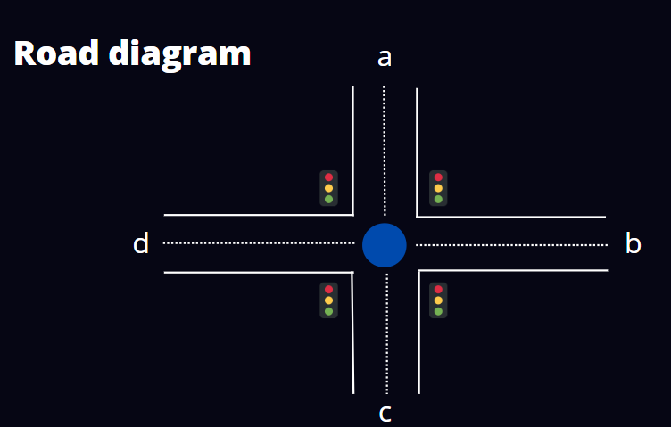
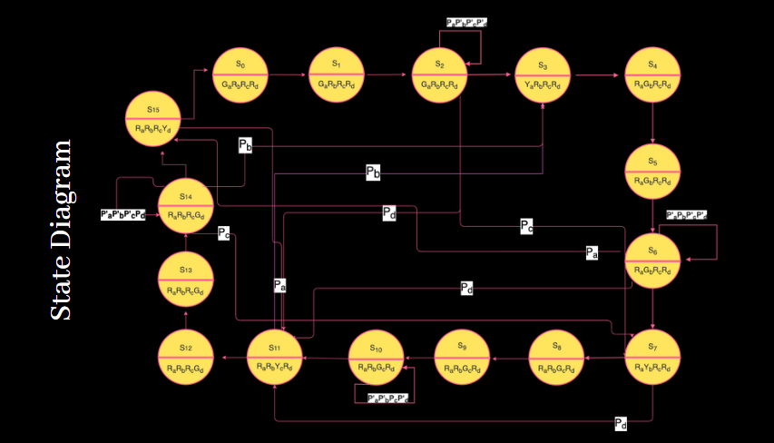

# Traffic Light Controller-Digital Design
- This repository contains implementation of a traffic light container using verilog hdl.
- The traffic light controller is designed for a 4-way circle, with 1 traffic light for each road.
- Free left turn is always available whereas for straight and right turn one has to follow the traffic signals.
- The traffic light controller also has a feature to override the automatically generated traffic light signal and give green signal to a preferred road if required.

## Road Schematic:

 

## State Diagram:

 

